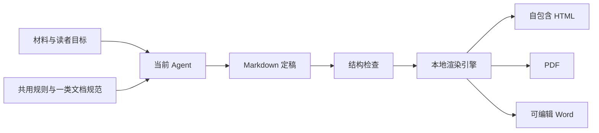

# 内容交付 v0.1：实现过程与经验

日期：2026-09-20。当前已实现第一个插件；项目 AI 配置初始化、交付验收助手仍在规划。

## 设计取舍

需求同时包含“写得好”和“交得出”。前者依赖材料、读者与 Agent 推理；后者需要稳定的程序实现。因此保留一份 Markdown 定稿，将写作指南、内容检查和格式导出分开。

只有 `src/dsh.js` 导入 Harness SDK。引擎与 CLI 是普通 Node.js 模块；其他 Agent 可以安装同一个 Skill 或读取 `guide`。这样不会因为更换 Agent 而重写导出逻辑。

## Skill 如何共用

入口 `SKILL.md` 只负责模式选择、文档路由与完成条件。共用表达规则处理读者、事实、逻辑、条件和术语；五类规范各自回答不同读者问题。图示与导出规则横向复用。

下载了 4 个上游仓库中的 7 个 Skill，保留固定提交、原文、参考文件、许可证与 SHA-256。上游快照和本地适配分开，便于看清改动、更新和追溯。默认只加载本地短指南，需要具体方法时再读取上游。未把所有 Skill 当成一套同时执行的指令。

PRD 重点是需求与验收；说明文档重点是理解；详细设计重点是可实现性和取舍；博客保留作者观点；调研区分来源事实与分析。共享表达原则，不共享僵硬的章节模板。

## 引擎如何实现

`markdown-it` 解析一次内容结构；图片先校验并用 `sharp` 标准化，Mermaid 使用本地浏览器渲染，图源另存。HTML 使用自包含图片和禁脚本策略；PDF 打印同一 HTML；`docx` 根据同一结构建立原生标题、段落、列表和表格。

所有格式复用内容和图，不分别调用模型生成。保留 source.md、自动检查结果和产物哈希。输出目录必须是新目录；丢图、坏图或导出失败会删除本次新建的半成品，不覆盖旧文件。

## 验证记录

本机环境：macOS、Node.js 22.23.0、Chrome；Harness 0.1.0-rc.6。运行记录如下：

| 验证 | 结果与覆盖 |
| --- | --- |
| `npm test` | 10 项通过：路由、内容保留、检查、图片、Word 结构、失败清理、禁止覆盖、上游哈希、Skill 安装 |
| `npm run test:integration` | 2 项通过：五类示例 × 三种格式，离线 HTML、手机宽度、图嵌入、错误 Mermaid |
| `scripts/test-harness.mjs` | 真实 Cordis 服务加载、三个工具调用、路径越界拒绝、卸载清理通过 |
| 独立安装包 | tarball 安装后导出 HTML / DOCX、完整 Skill 安装通过 |
| Skill 结构校验 | `skill-creator` 的 quick_validate 通过 |
| 视觉检查 | 详细设计示例 PDF 与 LibreOffice 渲染的 Word，检查中文、图、表格和分页 |

Harness 可复现检查：先让插件解析到现有 Harness 同版本的 `@deepseek-ai/dsh-tools`，再设置 `DSH_MODULE_ROOT` 为该安装的 `node_modules` 目录，运行 `node scripts/test-harness.mjs`。它使用临时工作目录，不启动模型，也不修改实际 profile。

添加 GitHub Actions，在 Ubuntu 上安装 Chromium、中文字体并运行单元与格式集成测试。CI 的实际状态以仓库运行记录为准；本地测试通过不代表所有系统和 Office 版本均已验证。

未进行真实模型端到端会话、不同模型写作质量评测、Windows Word 实机测试。Baoyu 图像流程需要外部图像后端，仅保留可选指南，没有伪装成已实现的生图功能。

## 实际踩到的问题

1. **Word 中有中文，不等于显示正确。** DOCX 的 XML 检查通过，预览器仍可能缺字。分开设置西文字体与东亚字体，并修正预览环境字体发现后，中文才正确显示。最终交付必须打开产物看。
2. **可选 SDK 要真的可选。** Harness 入口单独暴露，普通 CLI 不导入它；同一 package 可以在非 Harness 环境工作。
3. **Skill 文件不是导出引擎。** 好指南解决如何表达，代码负责文件、图片、格式和错误状态。职责清楚才容易测试和复用。
4. **上游下载要可追溯。** 复制原文同时记录提交与许可证，适配另写。升级时可以逐文件比较，而不是不知道最初抄了哪个版本。
5. **自动检查不能冒充验收。** 文档没有 TODO 不代表论证充分；manifest 哈希不代表事实可靠。自动结果要带限制和读者复查问题。

## 下一步的合理方向

先用真实 PRD、设计和调研材料验证五类指南，记录哪些说明总是要手动补。遇到实际痛点再增加模板、主题、公式或图表能力。

项目初始化插件可以管理偏好的 Skill 与配置，但不应偷偷覆盖已有 AGENTS.md。交付验收助手可以读取需求、检查结果和测试证据，但应维持独立插件边界；它的验收范围会比本文的文档结构检查更广。
