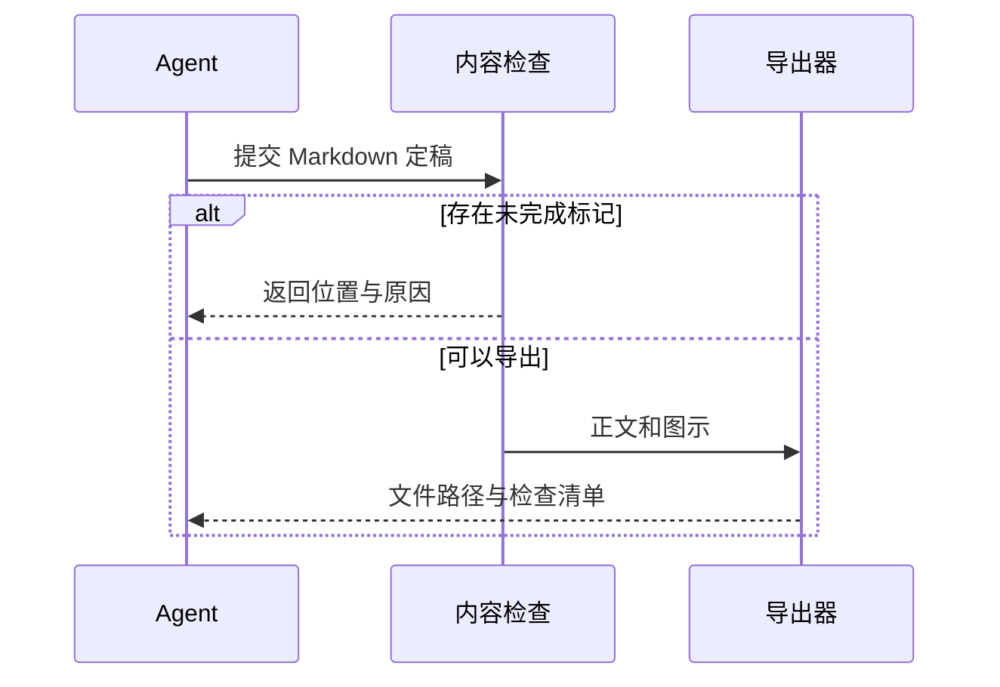

# 内容导出任务的详细设计

本设计采用同一份 Markdown 定稿生成 HTML、PDF 和 Word。写作由当前 Agent 完成，导出器负责可重复的格式转换，以减少不同格式之间的内容差异。

## 目标与边界

本文描述本地导出路径。它不包含在线协作、自动发布或图像生成服务。下面的流程是设计示例，不能当成服务性能的实测结果。

## 模块职责

| 模块 | 输入 | 输出 |
| --- | --- | --- |
| 文档解析 | Markdown 定稿 | 标题、段落、表格等结构 |
| 图示渲染 | Mermaid 图源 | PNG 图片与可编辑图源 |
| 格式导出 | 内容结构和图片 | HTML、PDF、DOCX |

## 关键交互

导出之前检查正文占位符。图示无法渲染时返回错误，不交付缺图的文件。



## 接口约定

输入参数如下；输出目录必须尚不存在。

```json
{
  "input": "final.md",
  "out": "delivery-v1",
  "formats": ["html", "pdf", "docx"]
}
```

1. 解析并检查正文。
2. 准备交付资源。
   - 渲染图示并检查错误。
   - 保存图源，方便后续修改。
3. 导出所选格式并记录哈希。

## 失败与验证

如果图片丢失，整个导出失败；如果发现已有输出目录，保留旧交付并要求使用新目录。哈希用于检测文件改变，**不能证明文档里的事实真实**。

> 检查通过仅代表自动检查覆盖的项目通过，仍需阅读正文和查看页面。

验收时分别打开三种格式，检查中文、图示、列表和表格。正文中“可能”“只有在某条件下”等限制不得因转换而丢失。

## 参考资料

- [Markdown 语法参考](https://spec.commonmark.org/)
- [Mermaid 官方文档](https://mermaid.js.org/)
