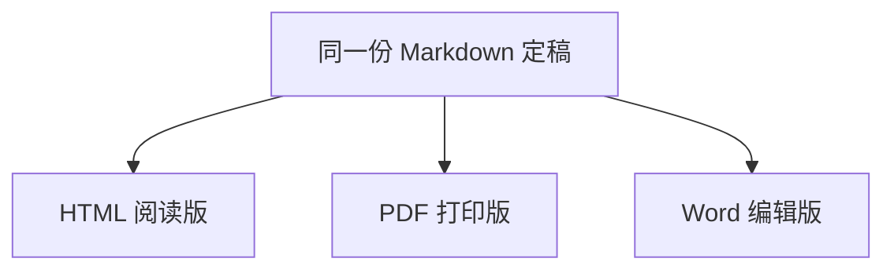

# 为什么内容和格式应该分开处理

同一篇文章可能用于浏览器阅读、打印归档和协作修改。把正文与呈现分开，可以在保留一份定稿的同时生成不同文件。

## 两层分别做什么

内容层保存作者要表达的观点、依据和条件；呈现层决定标题字号、分页和图片布局。例如，把“只有输入有效时才导出”排成粗体，并不会改变这个条件。

图中的分支表示同一份内容进入三个呈现路径，而不是先生成 HTML，再让模型重写成另外两篇文章。

## 一个容易混淆的区别

| 操作 | 是否可以改写正文 |
| --- | --- |
| 原样排版 | 不可以 |
| 表达优化 | 可以，但要保留事实与条件 |

## 适用边界

当文档依赖复杂交互时，静态 PDF 无法保留完整体验。此时需要补充静态说明，而不能只保留一个无法点击的按钮截图。
