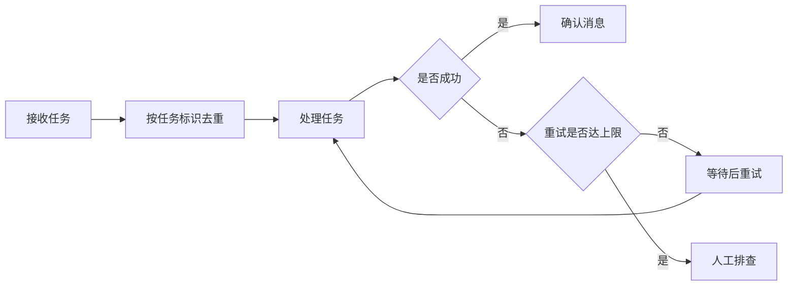

# 消息失败后，任务怎样继续？

这是一份虚构的演示材料，面向接手项目的工程师：队列通过重试减少临时失败，但业务接口仍需支持幂等，才能避免重复操作产生副作用。

## 从接收任务到处理结果

先按唯一任务标识去重。处理成功后才确认消息；失败时每隔 5 秒重试，最多重试 3 次，达到上限后交给人工排查。

## 去重的边界

任务去重不能保证外部接口没有重复副作用。调用外部服务时，需要业务接口支持幂等；不能把“队列有去重”理解为“重复扣款等问题已经解决”。

[示例说明](https://example.com/queue-spec)仅作链接保留测试，不作为真实技术来源。
