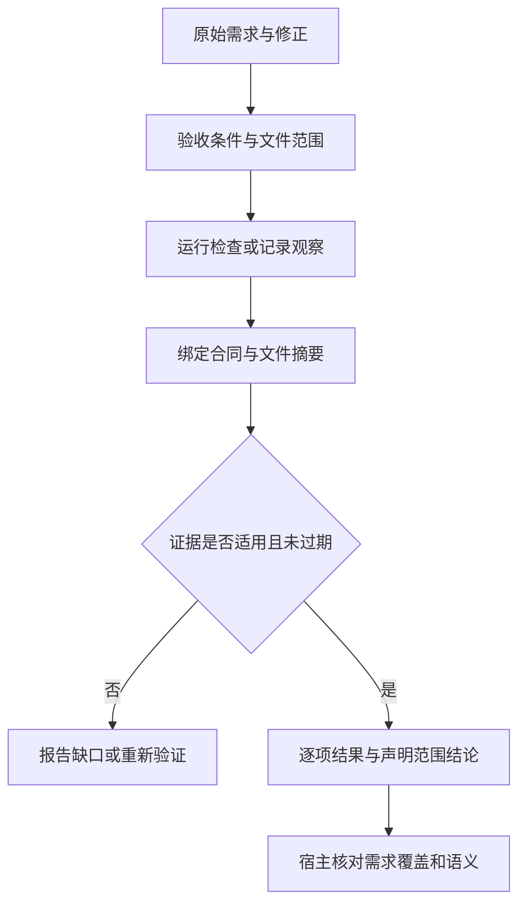

# 交付验收助手

将原始任务转为可追溯验收项，采集当前声明范围的命令或文件证据，报告已验证、失败与缺口。默认只验收，修复须来自用户当前任务授权。

| 文件 | 职责 |
| --- | --- |
| src/storage.js | 路径检查、有限范围快照、原子新增记录 |
| src/index.js | 合同验证、检查执行、观察与报告判断 |
| src/cli.js | CLI、退出码和 Skill 安装 |
| src/dsh.js | 固定 workspaceRoot 的五个工具与 Skill |
| skills/delivery-acceptance | 原始需求、验证适配、遗漏检查与修复循环 |
| tests/acceptance.test.js | 真实进程、过期、手工观察、路径、锁、CLI、上游哈希 |

报告与记录通过同一批次锁避免竞争；命令前后比较 scope 内容，修改时结果 stale。记录绑定目标根目录和合同，不能直接挪到其他项目当作有效证据。每项最后一次记录决定当前状态，历史不覆盖删除。

manual 正向结果和 derived 条件不能自动组成完成结论。自动 verified-within-scope 不保证需求覆盖完整，host 仍负责检查语义；没有防篡改、生产状态认证或人工签收。命令不沙箱，运行范围由用户任务和宿主权限决定。退出码 0 仅证明已配置断言，不替代实际业务证据。
