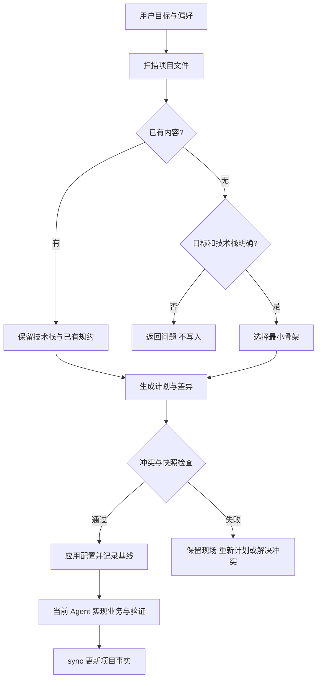

# 项目 AI 配置初始化

为用户当前目标生成项目级 Agent 配置，并为明确的空项目需求建立最小工程骨架。

## 边界

当前 Agent 负责理解问题、读取现有指令、选择技术方案和解决语义冲突。确定性引擎负责文件扫描、配置规划、归属判断和写入。骨架生成不等于业务交付，不运行待配置项目的代码。

## 实现地图

| 文件 | 职责 |
| --- | --- |
| src/preferences.js | 参考证据读取、可复用模板导出 |
| src/tooling.js | 工具需求、固定版本 CodeGraph 安装与 MCP 覆盖层 |
| src/scan.js | 有边界的文件清单、manifest 线索与命令来源 |
| src/starters.js | 保守路由、四种零依赖骨架 |
| src/render.js | 预设、规则入口与项目事实输出 |
| src/files.js | 路径校验、符号链接拒绝、按文件原子替换 |
| src/index.js | 计划、快照、受管理区域、锁、回滚与检查 |
| src/cli.js | 本地命令行及 Skill 安装 |
| src/dsh.js | 七个工具和运行时 Skill，固定 workspaceRoot |
| presets/peter.json | 可迁移个人偏好；无业务服务配置 |

## 状态与验证

config 是用户可编辑的来源，state 记录管理归属与基线。受管理区外不动，骨架创建后不覆盖。冲突不应用；过期计划拒绝；失败回滚不覆盖期间发生的用户修改。进程强杀后的恢复需用户核对 Git 与锁文件，不承诺持久事务。

测试地图：tests/project.test.js 覆盖行为与数据保护；tests/cli.test.js 覆盖安装包入口与退出状态；scripts/test-project-ai-harness.mjs 验证真实 SDK 注册、调用、计划失效、同步与卸载。用户参考项目只读预览验证了不同子项目的包管理器识别。

偏好分两层：preset 是跨项目模板，projectRules 仅用于当前项目。参考仓库只读，语义提炼由宿主 Agent 完成，导出不包含项目调整。工具安装与配置写入是独立操作：CodeGraph 安装失败不回滚已下载依赖；完成索引后仍需宿主连接验证。
